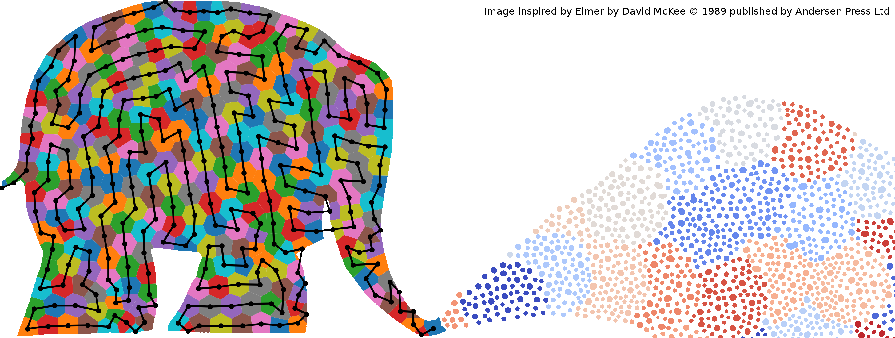

# TipSlicer
Cross-platform alternative Slicer for Nanoscribe GT Systems written in Python3 using Numpy, Scipy, OpenCV and PyTables.

This program provides an alternative to Describe and is capable of creating GWL code starting from an STL-file or a programmatic definition of an object. The basic usage of the program is demonstrated in the separate jupyter notebooks included in the repository. Objects can be created in shell-and-scaffold or solid mode and the different velocities and intensities can be programmed. Remark that this code is intended as a testbed for alternative slicing/stitching techniques and not as a full-on replacement for Describe. Hence, do not expect faster or more stable stl-slicing. However, it is meant as a learning tool, so more debug output and intermediate pictures can be generated while writing (for instance to make a movie of the writing sequence).

One of the core functionalities of the program is the implementation of adaptive stitching techniques. In our recent article (Additive Manufacturing, Volume 21, May 2018, Pages 589-597), we describe how, in certain cases, this has allowed us to reduce the manufacturing time of microfluidic channels by 25%. Also for the manufacturing of microlens arrays, we demonstrated how we can avoid stitching lines altogether. In the figure below, the adaptive stiching algorithm and subsequent block ordering algorithm is demonstrated on an artistic image.

Another important capability of the program is that objects can be defined mathematically and sliced directly to a defined precision without going to an intermediate lossy triangulated format. Instead, objects are sliced directly into a volumetric 3D matrix stored in a hdf5 file. This stack can then be processed to different gwl files using different shell and scaffold parameters. A conversion of this stack to a set of images to be used in STL printers (such as AutoDesk Ember) should be straightforward but is not implemented yet.

So, if you find this software useful, please cite the following paper:

>	S. Dehaeck, B. Scheid & P. Lambert,
>	Adaptive stitching for meso-scale printing with two-photon lithography,
>	Additive Manufacturing, Volume 21, May 2018, Pages 589-597

Still on the to-do list:

* Slanting of blocks to reduce stitching errors
* 3D Visualisation of results (use Describe to look at generated GWL files)
* Directly write binary gwl files; For now, we are only able to write ascii-gwl files, Describe or Nanowrite needs to convert them to binary before writing the structure. Depending on the size of the file, this can take some time. 
